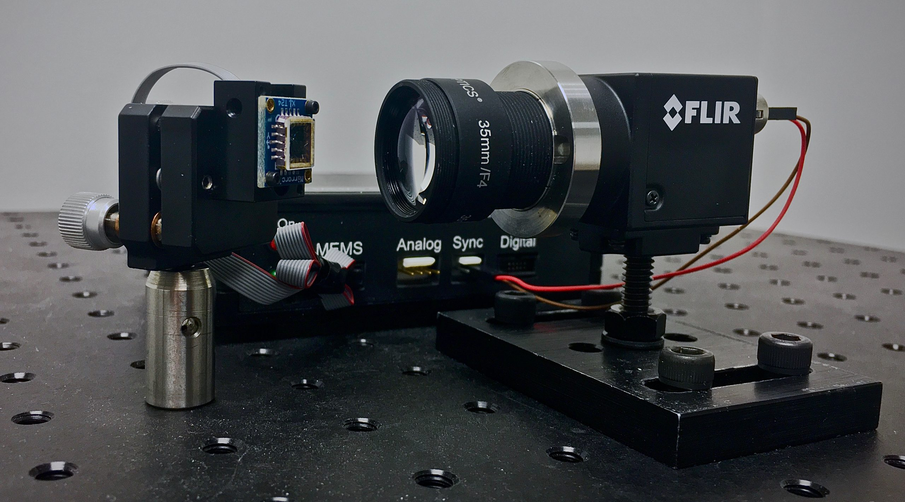

# FoveaCam

This is a python implementation of the control algorithm implemented in our paper "FoveaCam: A MEMS Mirror-Enabled Foveating Camera", which was published in the 2020 International Conference on Computational Photography. The code simulates a MEMS mirror tracking two targets with the closed-loop differential control algorithm from our paper. 

Given a pair of probability distributions, which could be the output of a computer vision detection from a colocated sensor or from our foveating camera, our algorithm differentiably updates the motion of the MEMS scanning path to quickly track between targets. We plan on extending the tracking to more than two distributions in the future. 

[[Project Page](http://focus.ece.ufl.edu/foveating-cameras/)] [[Paper](https://btilmon.github.io/pubs/foveaCam_iccp20.pdf)]

# Simulation
<p align="center">
  
</p>

<p align="center">
  
</p>


If you find our code useful, please cite:
```
@INPROCEEDINGS{9105183,
  author={B. {Tilmon} and E. {Jain} and S. {Ferrari} and S. {Koppal}},
  booktitle={2020 IEEE International Conference on Computational Photography (ICCP)}, 
  title={FoveaCam: A MEMS Mirror-Enabled Foveating Camera}, 
  year={2020},
  volume={},
  number={},
  pages={1-11},
  doi={10.1109/ICCP48838.2020.9105183}}
```

# Install
1. install python 3.6 (any python 3 probably works), numpy, scipy, matplotlib
3. git clone this repo
4. python main.py

The simulation should then begin.
