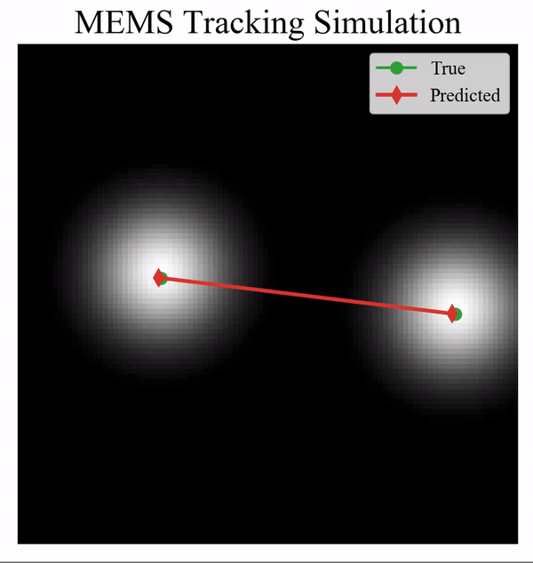

# [ICCP 2020] FoveaCam: A MEMS Mirror-Enabled Foveating Camera
This is a reference implementation of the control algorithm implemented in our paper "FoveaCam: A MEMS Mirror-Enabled Foveating Camera", which was published in the 2020 International Conference on Computational Photography. The code shows a simulation of a MEMS mirror tracking targets based on our control derivatives from the paper. If you find our code useful, please cite:

```
@INPROCEEDINGS{9105183,
  author={B. {Tilmon} and E. {Jain} and S. {Ferrari} and S. {Koppal}},
  booktitle={2020 IEEE International Conference on Computational Photography (ICCP)}, 
  title={FoveaCam: A MEMS Mirror-Enabled Foveating Camera}, 
  year={2020},
  volume={},
  number={},
  pages={1-11},
  doi={10.1109/ICCP48838.2020.9105183}}
```


<p align="center">
  
</p>

# Install
1. install numpy
2. install matplotlib
3. git clone <link>
4. python main.py

The simulation should then begin.
